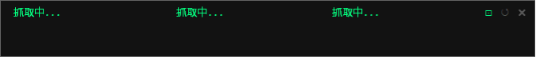

# Claude Monitor

桌面懸浮 HUD，即時顯示 Claude Code 的用量百分比（本次 session、本週、加購額度）。

---

## 畫面預覽




---

## 功能

- **即時用量**：顯示 Current session / Weekly / Extra usage 三欄並排百分比進度條
- **顏色警示**：進度條與文字（label、重置時間）同步變色。綠色 < 70%，黃色 ≥ 70%，紅色 ≥ 90%
- **重置時間**：自動轉換為 Asia/Taipei 時區
  - Current session：顯示「in X hr XX min」（倒數）
  - Weekly：顯示「Tue 3:00am」（星期幾 + 時間）
  - Extra：顯示月份日期
- **自動刷新**：每 5 分鐘自動重新抓取一次
- **手動刷新**：右上角 ↺ 按鈕或右鍵選單
- **釘選**：右上角 ⊡ 按鈕，預設已釘選（綠色，鎖定位置），點一下解除（可拖曳），再點一下重新釘選
- **拖曳移動**：未釘選時，拖曳視窗任意區域皆可移動
- **強制置頂**：每秒重新確認視窗在最上層，工具列蓋過去後自動恢復
- **無邊框 + 圓角**：透過 Windows DWM API 實現圓角
- **透明度**：75% 不透明
- **無 cmd 視窗**：透過 `.vbs` 啟動，背景執行無視窗
- **截圖**（已註解）：`Ctrl+S` 對 HUD 截圖，存成 `claude_monitor_demo.png`。需安裝 `Pillow`，取消 `__init__` 與 `_save_screenshot()` 的註解即可啟用

---

## 檔案結構

```
claude_monitor.py    # 主程式
claude_monitor.vbs   # 雙擊啟動器（放在桌面）
```

---

## 環境需求

- **Windows 10/11**
- **Python 3.x**（需安裝 `pythonw.exe`）
- **套件：winpty**

```
pip install winpty
```

- **Claude Code CLI** 已安裝並登入（`claude.exe` 存在於 npm 全域路徑）

---

## 安裝與設定

### 1. 確認 Claude Code 路徑

打開 `claude_monitor.py`，確認路徑是否正確：

```python
CLAUDE_PATH = r'C:\Users\你的使用者名稱\AppData\Roaming\npm\node_modules\@anthropic-ai\claude-code\bin\claude.exe'
```

確認方法：
```
where claude
```

### 2. 安裝 winpty

```
pip install winpty
```

### 3. 啟動

**方法 A（推薦）：雙擊 `claude_monitor.vbs`**
- 無 cmd 視窗，背景靜默啟動

**方法 B：直接執行**
```
python claude_monitor.py
```

---

## 操作說明

| 操作 | 功能 |
|------|------|
| 拖曳視窗 | 移動 HUD 位置 |
| 點擊 ⊡ | 釘選 / 解除釘選（綠色 = 已釘選） |
| 點擊 ↺ | 手動刷新 |
| 點擊 ✕ | 關閉（同時結束背景 claude.exe） |
| 右鍵 | 選單（手動刷新 / 退出） |

---

## 技術原理

### 為什麼用 PTY？

Claude Code 的 `/usage` 指令是 slash command，只能在 TTY（終端機）環境下使用，透過 pipe 或 subprocess 直接呼叫會被忽略。

解法：使用 `winpty` 建立一個假終端機（Pseudo Terminal），讓 `claude.exe` 以為自己在真實終端機裡運行。

### 抓取流程

```
1. winpty.PtyProcess.spawn(claude.exe)     # 啟動 claude.exe
2. 等待 ">\xa0" 出現                        # 確認 prompt 就緒（約 6s）
3. 寫入 "/usage\r"                          # 送出指令
4. 等待 "spent" 出現在輸出中               # 確認資料完整（Extra usage 最後出現）
5. 送 ESC (\x1b)                           # 關閉 usage 畫面
6. 解析輸出，更新 UI                        # regex 擷取百分比、重置時間
7. 關閉 PTY，等待下次刷新                   # 每次都重啟以確保資料為最新
```

### 為什麼每次都重啟 PTY？

同一個 `claude.exe` process 在長時間運行後，`/usage` 回傳的資料會是舊的快取值，不會自動更新。重啟 PTY 可確保每次都拿到最新資料。

### Prompt 偵測

`>\xa0` = U+003E（`>`）+ U+00A0（Non-Breaking Space），這是 Claude Code 的 prompt 字元組合。

### 輸出清理

winpty 回傳的原始輸出包含 ANSI 控制碼、`\r` carriage return、以及部分 UTF-16 編碼造成的 null bytes（`\x00`）。`_strip()` 依序清除這三類，才能讓 regex 正確解析文字內容。

### 重置時間解析

Claude Code 輸出的重置時間格式不固定（`6:40pm`、`May 12, 3am`、`Jun 1` 等），且 winpty 的 terminal rendering 有時會吃掉字元（如 `Resets` → `Reses`）。`_format_resets()` 直接比對時間格式本身而非依賴前綴文字，統一轉換為 Asia/Taipei 時區顯示。

### Section 邊界解析

`parse_usage()` 將每個 section 的搜尋範圍限制在下一個 section 開始之前，避免固定長度 chunk 造成跨 section 誤抓。

---

## 常見問題

**Q：抓取一直失敗**
- 確認 `CLAUDE_PATH` 路徑正確
- 確認已登入 Claude Code（在 cmd 直接執行 `claude` 看能否正常啟動）
- 確認已安裝 `winpty`

**Q：關閉後後台還有 claude.exe**
- 正常關閉（點 ✕ 或右鍵退出）會自動清除
- 若強制關閉 Python，需手動在工作管理員結束 `claude.exe`

**Q：數據沒有更新**
- 這是正常現象，Claude Code 本身的 API 資料有延遲
- 每次刷新都會重新啟動 `claude.exe` 以確保拿到最新快取

**Q：視窗被工具列蓋住**
- 正常情況下每秒自動恢復置頂，1 秒內會回來

**Q：釘選後拖曳欄位，label 文字消失**
- 已修復。原因是 Text widget 的 scan 滾動機制在釘選時仍會捲動視圖，造成第一行被捲出畫面。

---

## 自訂設定

| 設定 | 位置 | 說明 |
|------|------|------|
| 刷新間隔 | `refresh_loop()` 的 `time.sleep(300)` | 單位秒，預設 300（5 分鐘） |
| 置頂檢查間隔 | `_keep_on_top()` 的 `root.after(1000, ...)` | 單位毫秒，預設 1000 |
| 黃色閾值 | `bar_tag = "err" if pct >= 90 else "warn" if pct >= 70` | 目前 70%，影響進度條與文字 |
| 紅色閾值 | 同上 | 目前 90%，影響進度條與文字 |
| 透明度 | `self.root.attributes("-alpha", 0.75)` | 0.0~1.0 |
| 起始位置 | `self.root.geometry("+30+1106")` | 螢幕左上角偏移 |
| 預設釘選 | `self.pinned = True` | True = 啟動時鎖定，False = 啟動時可拖曳 |
| 時區 | `TAIPEI_TZ` | 預設 Asia/Taipei (UTC+8) |

---

## 截圖功能（已註解）

程式內建截圖功能，預設為關閉狀態。啟用方式：

1. 安裝 Pillow：
```
pip install Pillow
```

2. 取消 `__init__` 中的這行註解：
```python
# self.root.bind("<Control-s>", lambda _: self._save_screenshot())
```

3. 取消 `_save_screenshot()` 方法的所有註解

啟用後按 `Ctrl+S` 即可將 HUD 截圖存成 `claude_monitor_demo.png`（儲存於執行目錄）。

技術說明：使用 Windows GDI `PrintWindow`（`PW_RENDERFULLCONTENT=2`）直接從視窗 DC 抓取畫面，搭配 `DwmGetWindowAttribute` 取得含陰影的實際邊界，再透過 `GetDIBits` 轉成 PIL Image 存檔。
